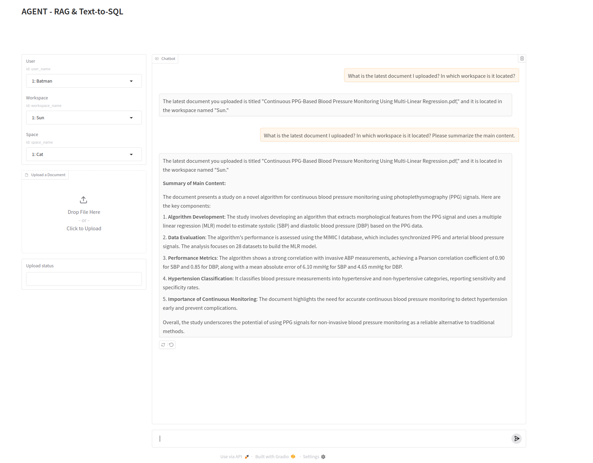
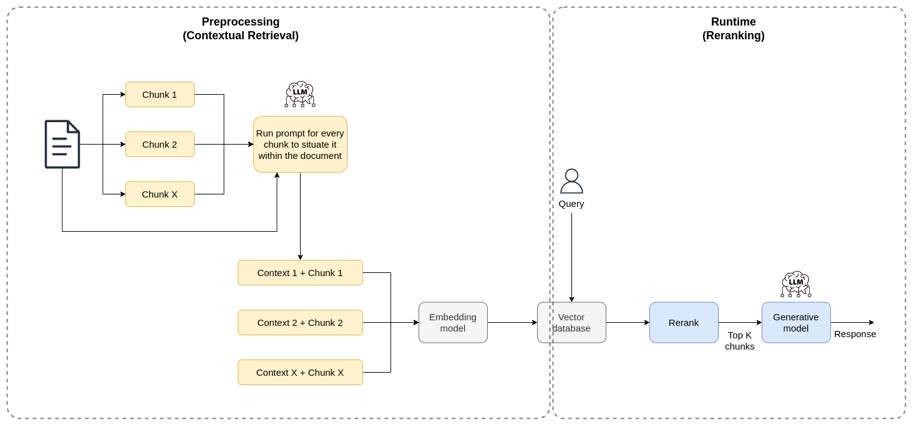
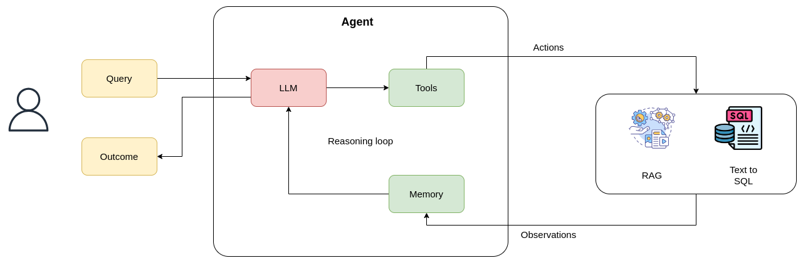

# AI Agent with RAG + Text-to-SQL

## Overview

This project is an AI-powered system that combines Retrieval-Augmented Generation (RAG) and Text-to-SQL techniques to create a unified AI Agent. It enables users to query both unstructured content (PDFs) and structured metadata (stored in a PostgreSQL database) related to workspaces and spaces. The system intelligently selects the most suitable approach—RAG, Text-to-SQL, or a combination of both—based on the user's query.

## Key Features

### 1. **PDF Ingestion & Vector Database**

- Users upload PDFs into specific workspaces and spaces.
- The system processes each PDF by:
  1. Splitting it into manageable text chunks.
  2. Embedding these chunks using a vector model.
  3. Storing the embeddings in a vector database for semantic search.

  #### Efficient Vector Search with HNSW
  To enhance search performance and retrieval efficiency, **Hierarchical Navigable Small World (HNSW)** indexing is used in **ChromaDB**. HNSW is a graph-based approximate nearest neighbor (ANN) algorithm that enables **low-latency** and **high-accuracy** vector search.

### 2. **Metadata Database & Text-to-SQL Tool**

- A **PostgreSQL** database tracks metadata about workspaces, spaces, and documents.
- Example schema:
  - **Workspaces Table**: Tracks workspace name, owner, last updated, etc.
  - **Spaces Table**: Tracks space name, associated workspace, document count, etc.
  - **Documents Table**: Tracks individual document metadata such as upload date, owner, etc.
- The **Text-to-SQL tool** (built with **LangChain** & **OpenAI**) translates natural language into SQL queries.

### 3. **AI Agent Flow**

The AI agent intelligently determines how to process queries:

- **RAG Approach**: For queries requiring unstructured document content.
- **Text-to-SQL Approach**: For queries needing metadata lookup.
- **Combination**: For queries requiring both metadata and document content.

### 4. **User Interface (Gradio Web App)**

- A simple **Gradio-based web interface** allows users to:
  - Upload PDFs to specific workspaces or spaces.
  - Ask questions that the system resolves using **RAG, Text-to-SQL, or both**.

## Methods

### 1. **RAG with Contextual Retrieval**

#### **Preprocessing**

1. **Chunk Splitting**:
   - Each uploaded PDF is divided into manageable chunks.
   
2. **Generating Context for Each Chunk**:
   - A **Large Language Model (LLM)** generates a contextual summary for each chunk.
   - This improves retrieval accuracy.

3. **Embedding**:
   - Contextualized chunks are embedded using OpenAI.
   - Stored in **ChromaDB** for efficient semantic search.

#### **Reranking**

1. **Initial Retrieval**:
   - Retrieves a broad set of candidate chunks (e.g., top 20) from **ChromaDB**.
   
2. **Rerank Results**:
   - The **rerank_results** function uses an LLM to prioritize the most relevant chunks.

3. **Final Context Generation**:
   - Combines the top-ranked chunks into a structured context for generating responses.

#### **Runtime Retrieval**

On receiving a user query:
  1. Retrieves chunks from **ChromaDB**.
  2. Refines results using **reranking**.
  3. Passes the top-ranked chunks to the LLM for response generation.

### 2. **Agent ReAct Framework (LangGraph + LangChain)**

The **AI Agent** operates based on the **ReAct (Reasoning and Action)** paradigm, implemented with **LangChain** and **LangGraph**. It combines reasoning and execution to process user queries efficiently.

#### **Core Principles of ReAct**

- **Reasoning**: The agent analyzes the query, breaks it down, and plans actions.
- **Action**: The agent invokes **RAG, Text-to-SQL, or both** to retrieve relevant data.
- **Observations and Iterations**: The agent refines responses iteratively.

#### **Agent Components**

1. **LLM (OpenAI GPT-based model)**:
   - Interprets queries and determines which tool to use.

2. **Tools**:
   - **RAG Tool**: Retrieves unstructured content via semantic search in **ChromaDB**.
   - **Text-to-SQL Tool**: Queries **PostgreSQL** metadata using natural language SQL translation.

3. **Memory**:
   - Stores context across user interactions for improved responses.

    
## Technology Stack

| Component         | Technology Used       |
|-------------------|-----------------------|
| **Vector Database** | ChromaDB (HNSW)       |
| **Embedding Model** | OpenAI                |
| **Text-to-SQL** | OpenAI + LangChain    |
| **LLM** | OpenAI GPT            |
| **Agent Framework** | LangChain + LangGraph |
| **Metadata Database** | PostgreSQL            |
| **Web Framework** | Gradio                |
| **Containerization** | Docker                |

